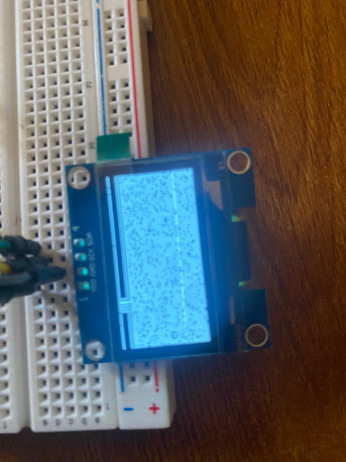
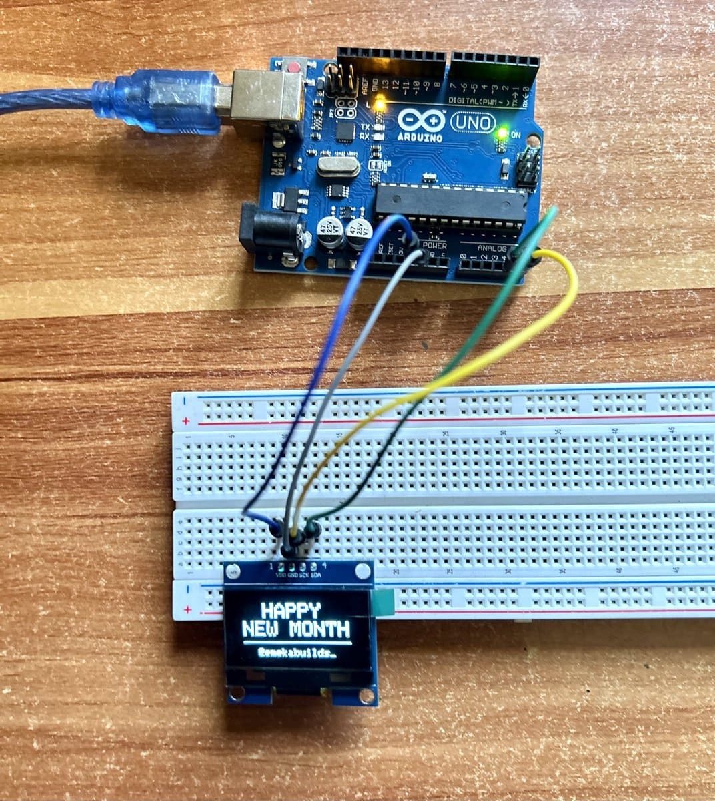

# 1.3" OLED Happy New Month Display (SH1106)

A simple but clean Arduino project to display a "Happy New Month" greeting and social handle on a 1.3-inch I2C OLED display.

## The Challenge
This project taught me why drivers matter in embedded systems. I spent way too much time staring at a weird screen because I assumed the 1.3" OLED worked exactly like the standard 0.96" versions.

Most smaller screens run on the `SSD1306` driver, but this specific 1.3" module uses the `SH1106`. When I tried to force the wrong library, I just got a blank screen and noise. It wasn't a hardware fail—it was a software mismatch. Switching over to the `Adafruit_SH110X` library finally brought the display to life.

### Driver Mismatch Error

*Figure 1: The OLED showing "static" noise due to the SH1106 chip receiving SSD1306 driver commands.*

## Wiring (Arduino Uno)
| OLED Pin | Arduino Pin |
| :--- | :--- |
| **VDD** | 5V |
| **GND** | GND |
| **SCK (SCL)** | A5 |
| **SDA** | A4 |

## How to Run
1. Install the `Adafruit SH110X` and `Adafruit GFX` libraries in the Arduino IDE.
2. Connect your OLED as shown in the wiring table.
3. Upload the `.ino` sketch.

## Result

---
---
*Built and documented by Chukwuemeka Ifeanyi | Mechatronics Engineering Student | April 2026 | [@emekabuilds_](https://x.com/emekabuilds_)*
